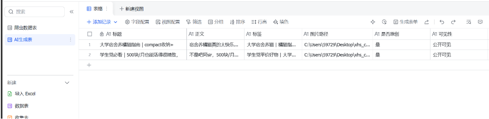
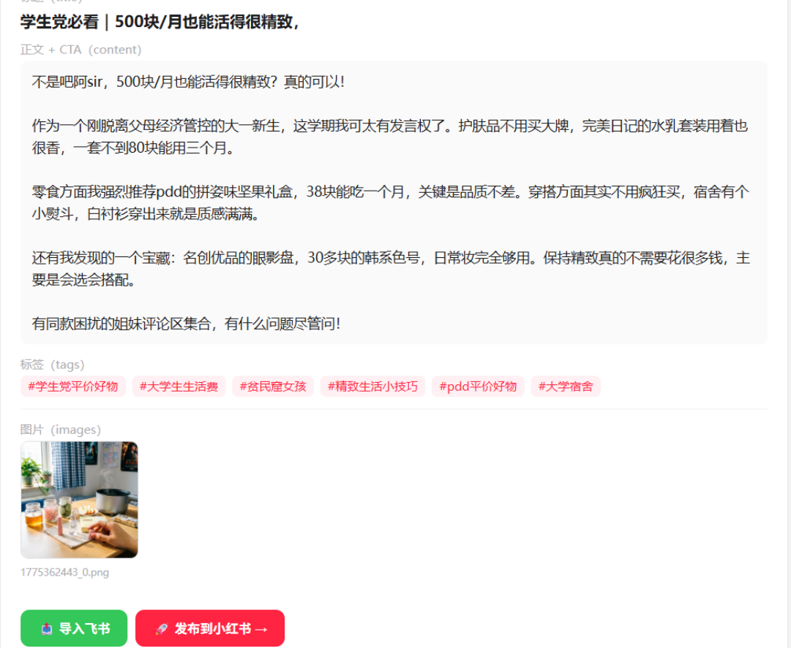
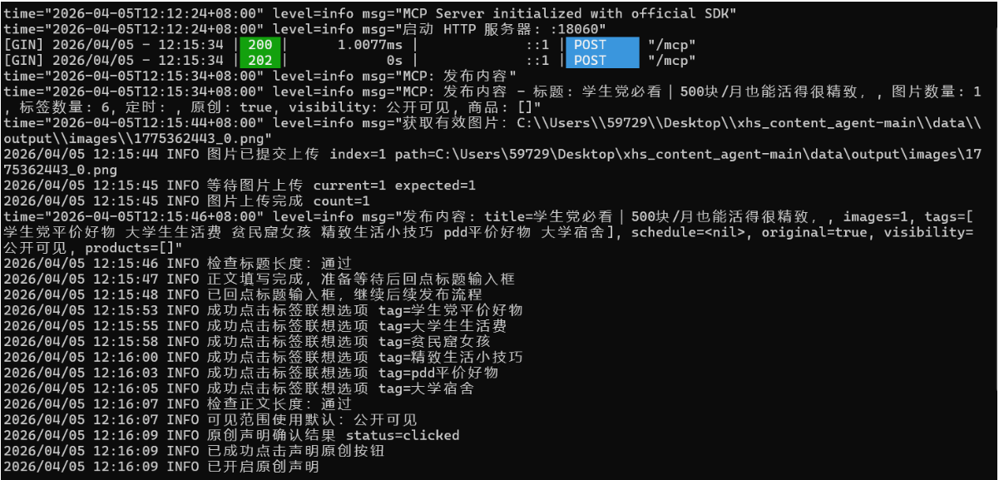

# XHS Content Agent — 小红书 AI 内容助手

基于 FastAPI + LangChain 构建的小红书内容挖掘与自动生成系统。支持从爬取竞品数据，分析爆款规律，AI 生成文案与配图，到一键发布的完整闭环。

---

## 功能概览

| 模块 | 说明 |
|------|------|
| 数据采集 | 通过 Playwright 爬取小红书搜索结果，自动跳过视频与广告 |
| 数据分析 | 提取高频关键词、热门标签、标题规律与用户洞察 |
| 话题生成 | 基于分析结果，LLM 生成高质量选题建议 |
| 内容生成 | 生成完整文案：正文、标题、标签、互动引导语、配图建议 |
| 图片生成 | 调用阿里百炼 `qwen-image-2.0-pro` 生成小红书风格配图 |
| 内容发布 | 支持 MCP 协议或 REST API 两种模式发布至小红书 |
| 评论自动回复 | AI 判断评论是否需要回复，生成自然回复内容并自动提交 |
| 飞书同步 | 将爬取数据与 AI 生成内容同步至飞书多维表格 |
| MCP Server | 封装为 MCP 工具，可在 Claude Desktop / Cursor 等 AI 工具中直接调用 |
| Web UI | 内置静态前端，提供爬取、生成、发布的图形化操作界面 |

---

## 技术栈

- **后端框架**：FastAPI + Uvicorn
- **LLM 调用**：LangChain + MiniMax-M2.5（OpenAI 兼容接口）
- **图片生成**：阿里百炼 `qwen-image-2.0-pro`
- **爬虫**：Playwright（Chromium）
- **MCP 协议**：`mcp` SDK（FastMCP）
- **飞书 API**：飞书多维表格 Open API
- **中文处理**：jieba 分词
- **数据验证**：Pydantic v2

---

## 项目结构

```
xhs_content_agent/
├── app/
│   ├── api/               # FastAPI 路由层
│   │   ├── routes_agent.py            # 主流水线
│   │   ├── routes_analysis.py          # 数据分析
│   │   ├── routes_comment.py          # 评论自动回复
│   │   ├── routes_content.py           # 文案生成
│   │   ├── routes_feishu.py           # 飞书同步
│   │   ├── routes_local_site_crawler.py # 爬虫
│   │   ├── routes_publish.py           # 发布
│   │   ├── routes_topics.py           # 话题生成
│   │   └── routes_xhs_service.py       # 小红书服务
│   ├── core/
│   │   └── config.py      # 配置管理（从 .env 读取）
│   ├── models/
│   │   └── schemas.py     # Pydantic 数据模型
│   ├── prompts/
│   │   ├── content_generation_prompt.txt
│   │   └── topic_generation_prompt.txt
│   └── services/
│       ├── agent_service.py            # 主流水线编排
│       ├── analysis_service.py         # 笔记数据分析
│       ├── topic_service.py           # 话题生成
│       ├── content_service.py         # 文案生成
│       ├── image_service.py           # 图片生成（阿里百炼）
│       ├── publish_service.py         # 小红书发布
│       ├── comment_service.py         # 评论自动回复
│       ├── feishu_service.py          # 飞书同步
│       ├── local_site_crawler_service.py # 小红书爬虫（Playwright）
│       └── mcp_client_service.py      # MCP 客户端
├── static/                # Web 前端页面（静态文件）
├── data/
│   ├── raw/               # 爬取数据 / Cookies / 状态文件
│   └── output/images/     # 生成的图片输出目录
├── tests/                 # 单元测试
├── xiaohongshumcp/       # 小红书 MCP 可执行文件
├── mcp_server.py          # MCP Server 入口
├── run.py                 # 服务启动入口
└── .env                   # 环境变量配置（勿提交）
```

---

## 快速开始

### 1. 安装依赖

```bash
# 创建虚拟环境
python -m venv .venv

# 激活虚拟环境
.venv\Scripts\activate        # Windows PowerShell
.\.venv\Scripts\Activate.ps1 # Windows PowerShell（受限执行策略时）

# 安装依赖
pip install -r requirements.txt

# 安装 Playwright 浏览器
playwright install chromium
```

### 2. 配置环境变量

在项目根目录创建 `.env` 文件（参考 `.env.example` 填写）：

```env
# ========== LLM 配置（MiniMax）==========
OPENAI_API_KEY=your_minimax_api_key
OPENAI_MODEL=MiniMax-M2.5
OPENAI_BASE_URL=https://api.minimaxi.com/v1
OPENAI_TEMPERATURE=0.7

# ========== 图片生成配置（阿里百炼）==========
IMAGE_API_KEY=your_ali_bailian_api_key
IMAGE_MODEL=qwen-image-2.0-pro
IMAGE_BASE_URL=https://dashscope.aliyuncs.com/api/v1/services/aigc/multimodal-generation/generation
IMAGE_SIZE=1024*1024

# ========== 飞书多维表格（可选）==========
FEISHU_APP_ID=
FEISHU_APP_SECRET=
FEISHU_APP_TOKEN=
FEISHU_TABLE_ID=          # 爬虫数据表
FEISHU_PUBLISH_TABLE_ID=  # AI 生成笔记表

# ========== 小红书 MCP 服务（本地）==========
XHS_MCP_URL=http://localhost:18060
XHS_MCP_ENDPOINT=http://localhost:18060/mcp
XHS_MCP_BINARY=path\to\xiaohongshu-mcp-windows-amd64.exe

# ========== 自动回复配置（可选）==========
FEISHU_REPLY_TABLE_ID=   # 回复记录表
COMMENT_MAX_NOTES=3       # 每次最多处理笔记数
```

### 3. 启动服务

```bash
python run.py
```

启动时自动携带 cookies 访问小红书，刷新 session 有效期，防止登录过期。

浏览器访问 `http://127.0.0.1:8000` 进入 Web UI。
FastAPI 交互文档（Swagger）：`http://127.0.0.1:8000/docs`

---

## 主要 API

| 路由 | 说明 |
|------|------|
| `POST /local-crawl/search` | 按关键词爬取小红书图文笔记 |
| `POST /local-crawl/login-status` | 查询爬虫登录状态 |
| `POST /analysis/analyze` | 分析笔记列表，提取关键词、标签、标题规律、洞察点 |
| `POST /topics/generate` | 根据分析结果生成话题建议 |
| `POST /content/generate` | 根据选题生成图文文案 |
| `POST /image/generate` | 根据文案生成配图 |
| `POST /publish/prepare` | 组装发布 Payload（REST / MCP 格式） |
| `POST /publish/send` | 发布至小红书 |
| `POST /comment/auto-reply` | 触发评论自动回复（AI 判断 + 生成 + 提交） |
| `GET  /comment/reply-records` | 查询已回复评论记录 |
| `POST /feishu/sync` | 将生成内容同步至飞书 |
| `POST /feishu/sync-crawled` | 将爬取数据同步至飞书 |
| `POST /agent/run` | 一键运行完整内容生成流水线（采集 → 分析 → 话题 → 文案 → 图片） |
| `GET  /health` | 健康检查 |

---

## 评论自动回复

### 功能说明

通过 MCP 获取自己笔记下的评论列表，由 LLM 判断每条评论是否需要回复并生成回复内容，自动提交回复。防重机制确保同一条评论不会被重复回复。

### 使用方式

```bash
# 自动回复最近 3 篇笔记的评论
POST /comment/auto-reply
Body: {"max_notes": 3, "audience": "大学生女性"}

# 指定笔记 ID
POST /comment/auto-reply
Body: {"note_ids": ["笔记ID1", "笔记ID2"], "audience": "大学生女性"}
```

### 定时任务配置（外部 cron）

```bash
# 每 2 小时触发一次（建议搭配随机抖动）
curl -X POST http://127.0.0.1:8000/comment/auto-reply \
  -H "Content-Type: application/json" \
  -d '{"max_notes": 3}'
```

---

## MCP Server 使用

将本项目封装为 MCP Server，可在支持 MCP 协议的 AI 工具（Claude Desktop、Cursor 等）中注册使用。

**启动 MCP Server：**

```bash
python mcp_server.py
```

提供以下 MCP 工具：

| 工具 | 说明 |
|------|------|
| `run_content_pipeline` | 完整运行内容生成流水线 |
| `generate_xhs_images` | 根据文案生成配图 |
| `publish_to_xhs` | 生成配图并一键发布至小红书 |
| `check_xhs_login` | 检查小红书登录状态 |

> **注意**：发布功能依赖本地运行的小红书 MCP 服务（默认端口 `18060`），需提前启动并完成扫码登录。

---

## 爬虫说明

### 登录态

首次运行爬虫时，程序会打开浏览器窗口引导登录小红书。登录完成后状态自动保存至 `data/raw/xhs_state.json`，下次启动时自动验证有效性，过期则重新引导登录。

### 采集数量为 0 或不足的排查

1. **视频比例过高**：搜索结果中视频笔记占多数，可换用不同关键词（如 `猫咪 日常` 而非 `猫咪`）
2. **日期过滤**：超过 1 年的图文笔记会被自动跳过
3. **网络超时**：卡片图片懒加载超时会导致该卡片被跳过，属正常现象
4. **登录失效**：删除 `data/raw/xhs_state.json` 重新登录

---

## 飞书同步说明

同步支持两种数据源：

- **AI 生成内容**：通过 `/feishu/sync` 接口同步
- **爬取数据**：通过 `/feishu/sync-crawled` 接口同步

字段映射自动从飞书多维表格 API 获取，支持：
- **日期字段**（type=5）：自动转换为 Unix 时间戳
- **URL 字段**（type=15）：自动转换为 `{link, text}` 对象格式
- **数字字段**：直接写入

---

## 账号安全注意事项

使用第三方自动化工具存在被平台检测的风险，以下措施可降低风险：

### 频率控制

- **每日评论回复上限**：不超过 20-30 条
- **单次操作间隔**：至少 5 分钟以上，两次操作间加入随机等待（30秒~15分钟）
- **避免深夜操作**：凌晨 0-6 点不触发自动化任务

### 行为模拟

- **随机化触发时间**：定时任务不要整点触发，加入 ±30 分钟随机抖动
- **间隔随机化**：`await asyncio.sleep(random.uniform(30, 900))` 代替固定间隔
- **批量操作有上限**：每次最多处理 3 篇笔记，不一次处理过多

### 账号保护

- **账号刚被处罚后**：立即停止所有自动化操作，等待 3-5 天后逐步恢复
- **主号与小号分离**：主号稳扎稳打，自动化测试用小号
- **内容原创**：避免批量发布高度相似内容

---

## 效果截图





